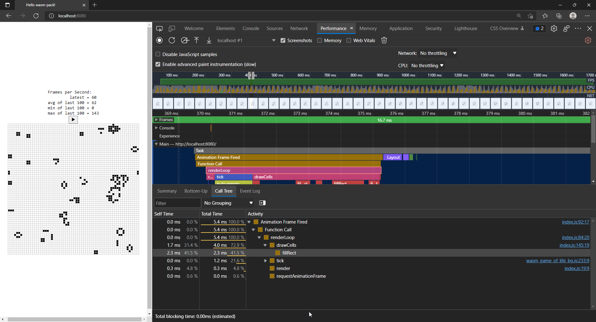
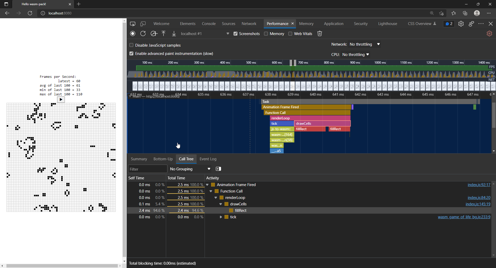

Book at https://rustwasm.github.io/docs/book/

.wat is webassembly text
.wasm is binary webassembly

Asks you to install `wasm-pack` and `cargo-generate`.
`cargo-generate` appears to be a way to set up a template repository.

## Hello, World!

The templete used was `cargo generate --git https://github.com/rustwasm/wasm-pack-template`.
It's _fast_, I hit enter and when I moved my eyes to the folder tree in VSCode, everything was already there.
This template appears to have lots of stuff I probably won't use (like travis and appveyor config files. I'll use Github actions if needed).

It sets up a bunch of things, like a `Cargo.toml` loaded with needed config.
One of the most important dependencies there is `wasm-bindgen`.

`lib.rs` is where most of the Rust happens.
It uses `wasm-bindgen` to bridge with JavaScript.
It sets up an external function called `alert`, that's the one from the browser.
If we call it here, the browser function will be called.

When running `wasm-pack build` in that generated directory I got an error.

```
warning: be sure to add `/home/nicky/.cache/.wasm-pack/.wasm-bindgen-cargo-install-0.2.78/bin` to your PATH to be able to run the installed binaries
Error: failed to download from https://github.com/WebAssembly/binaryen/releases/download/version_90/binaryen-version_90-x86-linux.tar.gz
To disable `wasm-opt`, add `wasm-opt = false` to your package metadata in your `Cargo.toml`.
```

Apparently the "fix" is to disable optimization.
That's kinda unacceptable and defats the point, but if it'll let me move on from the "hello-world" example, sure.
Adding this to `Cargo.toml`

```
# https://github.com/rustwasm/wasm-pack/issues/864#issuecomment-647850921
[package.metadata.wasm-pack.profile.release]
wasm-opt = false
```

That created a `pkg/` directory with a `package.json`, readme, a `.wasm`, `.ts`, and `.js` file.

The `.wasm` file is binary, so not human readable.

The `.js` contains glue for getting JavaScript things into Rust,
and letting the WASM functions be called from JS.
It imports things from that `.wasm` file.

For example, that `greet` function, it has an exported `greet` functions that wraps a call to the wasm `greet` function.

The `package.json` holds some metadata that's used by npm and js bundlers.

### Putting it into a web page

To put it in a webpage, use [`create-wasm-app`](https://github.com/rustwasm/create-wasm-app).

```
npm init wasm-app www
```

That created a `www/` folder.

That sets up a basic site with the necessary plumbing.
It uses webpack.
The WASM is now an npm package somehow.
That package has to be dynamically imported which is done in `bootstrap.js`.
That file is also the one inside the `<script src="./bootstrap.js">` tag in the HTML.

That `hello-wasm-pack` package contains the WASM code and the JS glue.
It is imported and used in `index.js` (which in turn is dynamically imported in `bootstrap.js`).

That npm package is imported with `* as wasm` in `index.js`.
Then the glue JS `greet` function is called with `wasm.greet()`.

`npm run start` boots the webpack server, and a site with an alert box pops up.
That box says `Hello wasm-pack` for now because that npm package we used is not our local one yet.

#### Using our local package

Instead of using that `hello-wasm-pack` package from npm, we want to use our local `wasm-game-of-life` one.

This is done by adding it in the www folder's package.json

```json
"dependencies": {
    "wasm-game-of-life": "file:../pkg"
},
```

Run `npm install` again and replace the import in `index.js`.

```js
import * as wasm from "wasm-game-of-life";
```

Restarting the webpack server with `npm run start` now opens a page with the message from `lib.rs`.
Rust to WASM, baby!

Chaging stuff in `lib.rs` doesn't automatically result in changes in that webpage.
The webpage pulls from that local package, so that has to be remade before a change in Rust takes effect.

So `wasm-pack build` has to be ran if changes are made in Rust.

Remember, `wasm-pack build` is ran in `wasm-game-of-life/`.
`npm run start` is ran in `wasm-game-of-life/www`.

---

I reinstalled wasm-pack today, just because _C O M P U T E R S_.
Uncommented the config in `Cargo.toml` that disabled `wasm-opt`.

What do you know, it works now.
I have no idea why, I hate this.
My best guess is WSL was missing some necessary plumbing wasm-opt relies on that got installed too with

```
curl https://rustwasm.github.io/wasm-pack/installer/init.sh -sSf | sh
```

---

## Implementing Conway's Game of Life

The game is played on an infinite plane.
Computers don't have infinite memory, so this guide chooses the field to be finite, and wrap around (off right edge, to left edge etc).

### Interfacing Rust and JavaScript

The self proclaimed "most important concepts of the book" are explained here, better pay attention.

JavaScript's memory heap (that is garbage collected) is seperate from WebAssembly's linear memory, where our Rust stuff lives.

- WASM has no direct access to that garbage collected heap (expected to change SOON:tm:).
- JavaScript can read and write to the WASM linear memory space

The way JS can read/write that memory is with an `ArrayBuffer` of scalar values (so, numbers).
WASM functions take and return scalar values.

Nicky: The things that get sent across the JS/WASM boundary are pointers to these scalar values.

`wasm-bindgen` defines defines a common way to communicate across this boundary.
It boxes Rust structs and wraps the pointer in a JavaScript class.
Or it can index into a table of JS objects from Rust.

Nicky: We write familiar Rust/JS data structures and wasm-bindgen converts it to those scalar values so JS/Rust can read what happened on the other side of the Rust/JS boundary.

For communication between WASM and JS, we want to optimize for a few things.

1. Minimizing copying into and out of the WebAssembly linear memory.
2. Minimizing serializing and deserializing.

Instead of serializing on one side, just to deserialize on the other.
Many times we can pass opaque handles (what does opaque mean in this context, smart pointer?) across the boundary instead, avoiding that work.
`wasm-bindgen` helps us define and work with opaque handles to JavaScript Objects or boxed Rust structures.

Nicky: Minimize work, then things go faster. Radical idea, right?

As a general rule of thumb, a good JavaScript↔WebAssembly interface design is often one where large, long-lived data structures are implemented as Rust types that live in the WebAssembly linear memory, and are exposed to JavaScript as opaque handles.
JavaScript calls exported WebAssembly functions that take these opaque handles, transform their data, perform heavy computations, query the data, and ultimately return a small, copy-able result.

So, we don't want to copy the entire game of life universe into and out of WASM linear memory on every tick.
We don't want to allocate objects for every cell in the universe.

We can represent the (2D) universe as a flat array that lives in the WASM linear memory, the 2 states for a cell are represented by either a 0 or 1.
One row laid out after another, no 2D array here, just a continuous array.

We can calculate the index of a cell in this array with the row and column nr.

```
index(row, column, universe) = row * width(universe) + column
```

To start, we implement `std::fmt::Display` for `Universe`.
This generates a Rust `String` that can be copied from the WASM linear memory into a JavaScript string that is stored in the JS garbage-collected heap.
Then it can be set in HTML via the `textContent` method on a DOM element.

The tutorial later changes this implementation to avoid copying between heaps and renders to a `<canvas>`.

### Rust implementation

Make a `Cell` enum

```rust
#[wasm_bindgen]
#[repr(u8)]
#[derive(Clone, Copy, Debug, PartialEq, Eq)]
pub enum Cell {
    Dead = 0,
    Alive = 1
}
```

The `repr` attribute makes sure each cell is represented by a single byte.
We set `Dead = 1`, and `Alive = 1` so we can count the number of alive neighbours by addition.

The `Universe` struct has a height, a width, and a vector of cells.
(that vector's length is width \* height)

```rust
#[wasm_bindgen]
pub struct Universe {
    width: u32,
    height: u32,
    cells: Vec<Cell>,
}
```

We implement a `get_index` method on the Univrse struct that takes a row and a col num, and return an index into the cells array at that point.

We implement a `live_neighbour_count` function that count the number of neighbours that are alive with that wrapping logic.

We implement a `tick` function that calculates the new cells in the universe and sets them.
Because we want JS to call this function, we add `#[wasm_bindgen]` to the `impl` block for `Universe`, and make the `tick` method `pub`.

We implement `Display` trait on `Universe` to get a human readable output of the `cells` vector.

We implement a `pub` `new` associated function on `Universe` to generate an initial universe with a cool pattern.
It's inside the `impl Universe` which has the `#[wasm_bindgen]` attribute, so it is exposed to JavaScript.

We implement a `pub render` method that returns the stringified universe via the `to_string` method we implemented through adding the `Display` trait.

### Rendering with JS

We add a `pre` tag to `index.html` that'll get populated.
Some styles to make it look less plain.

In the `index.js` file in `www/` we now import our `Universe` struct from Rust, that WASM turned into a JS object we can use.

It still has the methods we defined in Rust though, so we create a new instance by calling the `new` method on the `Universe` we imported.

```js
import { Universe } from "wasm-game-of-life";
const pre = document.getElementById("game-of-life-canvas");
const universe = Universe.new();

const renderLoop = () => {
  pre.textContent = universe.render();
  universe.tick();

  requestAnimationFrame(renderLoop);
};
requestAnimationFrame(renderLoop);
```

Rerun wasm-pack build, rerun npm run start, boom a game of life.

### Rendering to canvas directly from memory

Making a `String` in Rust (and storing it in the WASM linear memory) and then having wasm-bindgen convert it to a javascript string (which is stored in the JS memory) is expensive.
The same thing is stored in 2 locations.
It makes unnecessary copies of the universe's cells.

As JS can read the WASM memory, we'll modify our `render` method to return a pointer to the start of the cells array.
At the same time, we'll switch to a `<canvas>` HTML element to render the game of life.

To get the needed info into JS, we add a width and heigh getter in `lib.rs`.
We add a `cells` method that returns a pointer to the `cells` vector.

The `cells` method returns a raw pointer to the cells vector buffer, a `*const Cell`.
This kinda scares me, as raw pointers scream DANGER to me.
https://doc.rust-lang.org/std/vec/struct.Vec.html#method.as_ptr
But apparently it being WASM ensures some of the invariants that have to be upheld (like the memory it points to not disappearing).

If I understand correctly, that pointer points to the location in memory where the cells vector starts, that's why it's `*const Cell`, because that vector is filled with `Cell`s.

We change `<pre>` to `<canvas>`, access that DOM element in `index.js`.
Set a width and height by calling the functions on `Universe`.

Set the canvas size according to those values.
Draw a grid on the canvas.
Draw the cells on the canvas.
Each render loop consists of those steps.

1. calculate new state
2. draw grid
3. draw cells

The drawing of the cells uses direct access of the WebAssembly linear memory.
That is defined in that raw WASM module `wasm_game_of_life_bg` that `wasm-pack` generated inside the `wasm-game-of-life/pkg/` folder.
We can access the memory directly by importing it in our `index.js`.

We import `memory` from `wasm-game-of-life/wasm_game_of_life_bg`.
Nicky: is that the `.wasm` file or the `.js` file with that name?
I guess `.wasm` since I can't find a `memory` export from the js file.

```js
// Import the WebAssembly memory at the top of the file.
import { memory } from "wasm-game-of-life/wasm_game_of_life_bg";

// ...

const getIndex = (row, column) => {
  return row * width + column;
};

const drawCells = () => {
  const cellsPtr = universe.cells();
  const cells = new Uint8Array(memory.buffer, cellsPtr, width * height);

  ctx.beginPath();

  for (let row = 0; row < height; row++) {
    for (let col = 0; col < width; col++) {
      const idx = getIndex(row, col);

      ctx.fillStyle = cells[idx] === Cell.Dead ? DEAD_COLOR : ALIVE_COLOR;

      ctx.fillRect(
        col * (CELL_SIZE + 1) + 1,
        row * (CELL_SIZE + 1) + 1,
        CELL_SIZE,
        CELL_SIZE
      );
    }
  }

  ctx.stroke();
};
```

We get a pointer the the universe's cells via the `universe.cells()` method we defined in `lib.rs`.
We construct a `Uint8Array` in our `index.js` with that pointer combined with the height and width.
Remember, the cells vector is width \* height long.
Each item is a `Cell`, and we know each of those is exactly 1 byte big because we set `#[repr(u8)]`.

We iterate over each cell that way, and render a square on the corresponding location on the canvas with the alive or dead color.

By doing this we avoided copying so much memory across the boundary and storing the same thing in 2 locations.
Now, instead of the whole `String` representation of the `Universe` being copied to a JS string, we clone the pointer to the exact point in WASM memory and iterate over the cells by knowing exactly how big each one is, and how long that array in WASM memory goes on for.

In `index.js` we set up the initial state of the gameworld and draw it to the canvas before kicking off our renderloop.

```js
drawGrid();
drawCells();
requestAnimationFrame(renderLoop);
```

Each cell takes up a byte (8 bits) of space in memory (because of `#[repr(u8)]`).
We can make that space smaller since each Cell is a 1 or a 0, a single bit.

To do this, we can use the [fixedbitset crate](https://crates.io/crates/fixedbitset).

A `FixedBitSet` is a contiguous block of memory with 1s or 0s.

- Add it to `Cargo.toml`.
- Import the `FixedBitSet` type in `lib.rs` with `use fixedbitset::FixedBitSet;`
- Replace the `cells` field in `Universe` from a `Vec<Cell>` to a `FixedBitSet`
- Follow the compiler warnings and make the required changes.

The step where we get a raw pointer to the start of the cells is a bit weird.
We convert the `FixedBitSet` to a slice first, then take a pointer to that.
And it turns into a `*const u32` somehow?
I don't get the `u32` part.

In JavaScript, when we create the `Uint8Array`, it's 8 times smaller now, since a cell is no longer a byte, it's a bit.

We need an extra step of logic to determine if a bit inside that `Uint8Array` is set.
Previously, we indexed into it normally in JS.
Now, we can no longer do that, because each cell is a single bit, and indexing into a `Uint8Array` happens per byte.
So we make a `isBitSet` function to determine if a bit in that array is a 1.

```js
const isBitSet = (n, arr) => {
  const byte = Math.floor(n / 8);
  const mask = 1 << n % 8;
  return (arr[byte] & mask) === mask;
};
```

The tutorial also tells you to implement a random pattern for alive/dead cells at initialization.
For some reason, they don't use the `rand` crate, so I tried to use that.

Apparently `rand` doesn't support the target `wasm-pack` uses to run, which is `wasm32-unknown-unknown`.

```
| /         compile_error!("the wasm32-unknown-unknown target is not supported by \
220 | |                         default, you may need to enable the \"js\" feature. \
221 | |                         For more information see: \
222 | |                         https://docs.rs/getrandom/#webassembly-support");
```

This can be worked around by adding a direct dependency on `getrandom` to `Cargo.toml` and enabling the `"js"` feature.

```
getrandom = { version = "0.2.3", features = ["js"] }
```

The tutorial uses the `https://crates.io/crates/js-sys` crate and uses the JS `Math.random` through that instead.

## Testing Conway's Game of Life

Right now, the width and height are hardcoded.
We'll add a way to set the width and height of a universe in our `impl Universe` block.

We'll also create a new `impl Universe` block without the `#[wasm_bindgen]` attribute.
For things that we need for testig, we don't need those to leave the Rust world at any point.

Rust-generated WebAssembly functions cannot return borrowed references.
If we return references in the impl block that has bindgen, we get errors.

- We add a method to get a reference to the cells (the `FixedBitSet`).
- We add a method to set cells at certain coordinates to be alive.

We'll add the tests in `wasm_game_of_life/tests/web.rs`.

There is already one test there that asserts `1 + 1` is equal to `2`.

You can run them by running `wasm-pack test --chrome --headless` in the `wasm-game-of-life` directory.

```
  Running unittests (target/wasm32-unknown-unknown/debug/deps/wasm_game_of_life-d7f79f80a1a0d854.wasm)
no tests to run!
     Running tests/web.rs (target/wasm32-unknown-unknown/debug/deps/web-5a9c7d9313ab2625.wasm)
Set timeout to 20 seconds...
Running headless tests in Chrome on `http://127.0.0.1:43951/`
Try find `webdriver.json` for configure browser's capabilities:
Not found
driver status: signal: 9
driver stdout:
    Starting ChromeDriver 95.0.4638.54 (d31a821ec901f68d0d34ccdbaea45b4c86ce543e-refs/branch-heads/4638@{#871}) on port 43951
    Only local connections are allowed.
    Please see https://chromedriver.chromium.org/security-considerations for suggestions on keeping ChromeDriver safe.
    ChromeDriver was started successfully.

Error: non-200 response code: 404
{"value":{"error":"invalid session id","message":"invalid session id","stacktrace":"#0 0x562c19ea8f93 \u003Cunknown>\n#1 0x562c1998379f \u003Cunknown>\n#2 0x562c199ac67b \u003Cunknown>\n#3 0x562c199d69fc \u003Cunknown>\n#4 0x562c199d4742 \u003Cunknown>\n#5 0x562c199d3f77 \u003Cunknown>\n#6 0x562c1995b534 \u003Cunknown>\n#7 0x562c1995c3e0 \u003Cunknown>\n#8 0x562c19ed82be \u003Cunknown>\n#9 0x562c19eedba0 \u003Cunknown>\n#10 0x562c19ed9215 \u003Cunknown>\n#11 0x562c19eeefe8 \u003Cunknown>\n#12 0x562c19ecd9db \u003Cunknown>\n#13 0x562c1995b0ae \u003Cunknown>\n#14 0x7f6e3ffc60b3 \u003Cunknown>\n"}}
error: test failed, to rerun pass '--test web'
Error: Running Wasm tests with wasm-bindgen-test failed
Caused by: failed to execute `cargo test`: exited with exit status: 1
  full command: "cargo" "test" "--target" "wasm32-unknown-unknown"
```

Oh joy, so that didn't go as expected.
I suspect it's because of WSL and how things run in linux get a URL you can open in Windows.
So I try to run it without that `--headless` flag.
It works, I need to click a link at `http://127.0.0.1:8000/` and a webpage with black text on a white background opens telling me the test passed!

```
running 1 test

test web::pass ... ok

test result: ok. 1 passed; 0 failed; 0 ignored
```

That file has a bit of boilerplate, it's able to test if that code runs in different browsers via flags.
For example, firefox is `wasm-pack test --firefox`.

The link it spits out still opens in my default browser, which is Chrome at the mement.
That's midly amusing to me.

So the `wasm-pack test` command executes the functions that have the `#[wasm_bindgen_test]` attribute.
I think it converts them to WASM first and runs them in the browser.

We want to test our `tick` function.
We do this by constructing a known initial state of the universe.
Then manually calculating the state of that universe after one tick.

We assert that the initial universe's state after one call to `tick` is the same as our manually calculated one.

That is why we added those ways to set the width, the height, and a given array of bits earlier.

## Debugging

### Panics

Right now a panic displays a message with no useful information in the web console `RuntimeError: unreachable executed`.
We'd like to see the information a regular rust panic shows.

The `console_error_panic_hook` crate enables this and comes included with the template we used.
In the `src/utils.rs` file is a function that optionally sets this up if a certain feature is enabled (`#[cfg(feature = "console_error_panic_hook")]`).
We need to call this function in `lib.rs` somewhere, that way the panic hook gets set up if a feature is enabled.

We call it in the `new` associated function for `Universe`.

Introducing a panic in say our `new` function for `Universe` leads to a nice message with a stacktrace in the browser.
Make sure to build the wasm with a debug build that includes debug symbols, or the useful information won't be there.

`wasm-pack build --debug`.

> If you don't have debug symbols enabled, then the "name" custom section won't be present in the compiled .wasm binary, and stack traces will have function names like wasm-function[42] rather than the Rust name of the function, like wasm_game_of_life::Universe::live_neighbor_count.

### Logging

Like in JavaScript, I'd like to `console.log` things.
I tried `println!` and `dbg!`, but that didn't work.

We can use `console.log` via WASM through the [`web-sys` crate](https://crates.io/crates/web-sys).
We can call a function from that crate, and get logs in the browser console when the WASM runs!

Adding that depenency is a bit weird, I don't know TOML all that well, but this gets added to `Cargo.toml`.

```
[dependencies.web-sys]
version = "0.3.55"
features = ["console"]
```

It uses a feature for each type that's defined in `web-sys`, so what we did added support for the JS console, and only the console.

We make a `println!` style macro that uses the internal `web_sys::console::log_1` method, so we can call `log!("{}", thing)` from Rust.

```
use web_sys;

macro_rules! log {
    ( $( $t:tt )* ) => {
        web_sys::console::log_1(&format!( $( $t )* ).into());
    }
}
```

### Debugger to pause between ticks

The debugging story for WASM isn't all that good.

We can use the `debugger` statement in our JS though.
If we call it in our `renderLoop`, code execution in JS stops there, before it can call into our WASM again.

Handy place to see each generation, hitting the "play" button in the browser resumes code execution.
On the next loop of the renderloop, it'll hit the debugger statement again and pause.

## Adding Interactivity

I'd probably do this via JS, but I suspect the tutorial has more Rusty intentions.
edit from the future: it totally is via JS.

Add a `<button>` to the HTML.

In `index.js` we will keep track of the identifier the latest call to `requestAnimationFrame` returned.
That way, we can cancel it with `cancelAnimationFrame`.

Make a `play` and `pause` function that either calls the `renderLoop` functions, or calls `cancelAnimationFrame` with that stored id.

Hook up a click handler to the button that calls the correct function based on if an id exists or not.

Kick off the renderloop initially by calling `play`, that function also sets the button text.

### Toggling a Cell's state

Time to add the ability to change a cell from alive to dead or vice-versa on click.

This needs some logic in Rust.

The tutorial does this in the `Cell impl` block, but since I ripped that out I'll set the bit in the `FixedBitSet` at `Universe.cells` by adding a method to `Universe`.

```rust
pub fn toggle_cell(&mut self, row: u32, col: u32) {
    let idx = self.get_index(row, col);
    let curr_bit = self.cells[idx];
    self.cells.set(idx, !curr_bit);
}
```

Now, to call this function from JS with the correct row and col parameters.
This involves some light math.

- Get the `boundingClienRect` of the `<canvas>`.
- Calculate the scale on which it's shown on the screen.
- Calculate the position the mouse is inside the canvas.
- Calculate which row and col that corresponds to.
- Call the Rust function `universe.toggle_cell`
- draw the grid, and the cells to the canvas again.

## Time profiling

The browsers have a built in FPS timer (it's cool, access it via the devtools command palette) but let's build one ourselves!
Future edit: welp, the selfbuilt one says 60 fps and the browser one 30, weird.

- Add a div with id `fps` to the HTML

In `index.js`.

```js
class Fps {
  constructor() {
    this.fps = document.getElementById("fps");
    this.frames = [];
    this.lastFrameTimeStamp = performance.now();
  }

  render() {
    // Convert the delta time since the last frame render into a measure
    // of frames per second.
    const now = performance.now();
    const delta = now - this.lastFrameTimeStamp;
    this.lastFrameTimeStamp = now;
    const fps = (1 / delta) * 1000;

    // Save only the latest 100 timings.
    this.frames.push(fps);
    if (this.frames.length > 100) {
      this.frames.shift();
    }

    // Find the max, min, and mean of our 100 latest timings.
    let min = Infinity;
    let max = -Infinity;
    let sum = 0;
    for (const curr_fps of this.frames) {
      sum += curr_fps;
      min = Math.min(curr_fps, min);
      max = Math.max(curr_fps, max);
    }
    let mean = sum / this.frames.length;

    // Render the statistics.
    this.fps.textContent = `
Frames per Second:
         latest = ${Math.round(fps)}
avg of last 100 = ${Math.round(mean)}
min of last 100 = ${Math.round(min)}
max of last 100 = ${Math.round(max)}
`.trim();
  }
}
```

Instantiate the class once where we kick off the infinite loop `let fps = new Fps()`.
Call `fps.render()` to set that element's textcontents in the `renderLoop` function that calls `requestAnimationFrame`.

### Time each tick

Next, we want to use the [`console.time()` and `console.timeEnd()` methods](https://developer.mozilla.org/en-US/docs/Web/API/Console/time) to time each `Universe::tick`.

We can call those DOM methods by using the [`web-sys` crate](https://crates.io/crates/web-sys) in Rust.
We already set it up for our equivalent to `console.log`.

We enabled the `"console"` feature for that, perfact, as this needs the `console` too.

In `lib.rs` we create a `RAII` type (yay computer science) that calls `console.time` when that type is instantiated.
And calls `console.timeEnd` when it is dropped.

```rust
use web_sys;

pub struct Timer<'a> {
    name: &'a str,
}

impl<'a> Timer<'a> {
    pub fn new(name: &'a str) -> Timer<'a> {
        web_sys::console::time_with_label(name);
        Timer { name }
    }
}

impl<'a> Drop for Timer<'a> {
    fn drop(&mut self) {
        web_sys::console::time_end_with_label(self.name);
    }
}
```

Then in the `tick` method, at the top intantiate one.

```rust
let _ = Timer::new("Universe::tick");
```

Now rebuild with `wasm-pack build`, rerun the webpack-dev-server in www/ with `npm run start`.
LOTS of console logs.
Like, 60 a second.

```
Universe::tick: 0.005126953125 ms wasm_game_of_life_bg.js:273
Universe::tick: 0.005859375 ms wasm_game_of_life_bg.js:273
Universe::tick: 0.010986328125 ms wasm_game_of_life_bg.js:273
Universe::tick: 0.007080078125 ms wasm_game_of_life_bg.js:273
```

### Growing our Game of Life Universe

I made the `Universe::new()` function take a `width` and `height` so I can instantiate a different size from JS.
As expected, the FPS drops when rendering a bigger universe.

The tutorial uses Firefox to look at the performance devtools.
They changed, so I'm using Microsoft Edge (they're quite nice).



There we can see a full `renderLoop` took 5.4ms.
The call to `drawCells` took up a whopping 2.3ms of that time.
Inside, that function we do calls to `fillRect` on the canvas, that takes 2.3ms.

That's a big chunk of `drawCells`, and by extension a big chunk of the entire renderloop.

So the biggest bottleneck is in drawing to the `canvas`, not in our Rust code.

Apparently, the problem is the call do `fillStyle` in our `drawCells` function.
I can't see that in the performance tools since `fillRect` has no arrow in the call tree and is apparently the last call in that callchain.

Right now, we draw each cell individually.
Calculating and setting the needed `fillStyle` each time.
The tutorial's solution is to set it to `ALIVE_COLOR` and draw all alive cells first.
Then set it to `DEAD_COLOR` and draw all dead cells.

```js
  // draw alive cells
  ctx.fillStyle = ALIVE_COLOR;
  for(let row = 0; row < height; row++) {
    for (let col = 0; col < width; col++) {
      const idx = getIndex(row, col);
      if (!isBitSet(idx, cells)) {
        continue;
      }

      ctx.fillRect(
        col * (CELL_SIZE + 1) + 1,
        row * (CELL_SIZE + 1) + 1,
        CELL_SIZE,
        CELL_SIZE
      );
    }
  }

  // draw dead cells
  ctx.fillStyle = DEAD_COLOR;
  for(let row = 0; row < height; row++) {
    for (let col = 0; col < width; col++) {
      const idx = getIndex(row, col);
      if (isBitSet(idx, cells)) {
        continue;
      }

      ctx.fillRect(
        col * (CELL_SIZE + 1) + 1,
        row * (CELL_SIZE + 1) + 1,
        CELL_SIZE,
        CELL_SIZE
      );
    }
  }
```

Doing the same profiling now, we see only 2 calls to `fillRect`, that's one for alive, and one for dead cells.

.

The tutorials says:
> Breaking down a single frame, we see that the fillStyle cost is gone, and most of our frame's time is spent within fillRect, drawing each cell's rectangle.

Since I never saw `fillStyle`, but only `fillRect`, maybe the browsers got better in the time between this was written and I do this and that `fillStyle` cost got optimized somehow?

### Making time run faster

What if, every time the canvas is drawn, instead of 1 tick, we do 9 ticks?

So, in the `renderLoop` function in JS, call `universe.tick()` 9 times! Done!

But oh no, the FPS dropped again, unacceptable.

We know that extra time is spent in the WASM that's made from our Rust `Universe::tick`, so let's make that faster.

The tutorial goes into the allocating and manipulating the `Vec<Cell>` is taking a lot of time.
Since we used a `FixedBitSet`, and don't have a `Cell` struct, but `true` and `false` bits, that's already not an issue.
(we do allocate a new one each tick)

We trow around some timers to see what takes so long.
(It's so cool that blocks are expressions, return something, and drop things inside when they end)

```rust
    pub fn tick(&mut self) {
        let _ = Timer::new("Universe::tick");

        let mut next = {
            let _ = Timer::new("allocate next cells");
            self.cells.clone()
        };

        {
            let _ = Timer::new("calculate next generation");
            for row in 0..self.height {
            for col in 0..self.width {
                let idx = self.get_index(row, col);
                let cell = self.cells[idx];
                let live_neighbours = self.live_neighbour_count(row, col);
                let next_cell = match (cell, live_neighbours) {
                    (true, x) if x < 2 => false,
                    (true, 2) | (true, 3) => true,
                    (true, x) if x > 3 => false,
                    (false, 3) => true,
                    (cell, _) => cell,
                };
                next.set(idx, next_cell);
            }
        }}
        let _ = Timer::new("set next gen and free old generation");
        self.cells = next;
    }
```

If we build again, we see the calculation of the next generation takes the longest time.

```
Universe::tick: 0.003173828125 ms wasm_game_of_life_bg.js:275
allocate next cells: 0.003173828125 ms wasm_game_of_life_bg.js:275
calculate next generation: 0.00390625 ms wasm_game_of_life_bg.js:275 
set next gen and free old generation: 0.0068359375 ms wasm_game_of_life_bg.js:275 
Universe::tick: 0.010009765625 ms wasm_game_of_life_bg.js:275 
allocate next cells: 0.005859375 ms wasm_game_of_life_bg.js:275 
calculate next generation: 0.009033203125 ms wasm_game_of_life_bg.js:275 
set next gen and free old generation: 0.0029296875 ms
```

Apparently the way the tutorial draw this conclusion is by looking at the performance tab in devtools.
The console did just fine for this usecase, although looking at rectangles would make it easier to spot a longer one.

The next part uses the features from the [test feature gate](https://doc.rust-lang.org/unstable-book/library-features/test.html).
Which at the time of writing, needed nightly Rust to use.

It will also use [cargo benchcmp](https://github.com/BurntSushi/cargo-benchcmp), a small utility that, true to its name, compares outputs of `cargo bench`.

A new file in `wasm-game-of-life/benches/bench.rs`:

```rust
#![feature(test)]

extern crate test;
extern crate wasm_game_of_life;

#[bench]
fn universe_ticks(b: &mut test::Bencher) {
    let mut universe = wasm_game_of_life::Universe::new();

    b.iter(|| {
        universe.tick();
    });
}
```

> We also have to comment out all the #[wasm_bindgen] annotations, and the "cdylib" bits from Cargo.toml or else building native code will fail and have link errors.

> With all that in place, we can run cargo bench | tee before.txt to compile and run our benchmark! The | tee before.txt part will take the output from cargo bench and put in a file called before.txt.

Yea, no.
No linker errors or whatever, but this output on `cargo bench`.
To be certain, I ran `cargo build` beforehand.

```
running 1 test
panicked at 'cannot call wasm-bindgen imported functions on non-wasm targets', /home/nicky/.cargo/registry/src/github.com-1ecc6299db9ec823/web-sys-0.3.55/src/features/gen_console.rs:5:5
test universe_ticks ... FAILED

failures:

failures:
    universe_ticks

test result: FAILED. 0 passed; 1 failed; 0 ignored; 0 measured; 0 filtered out; finished in 0.00s
```

That's the same issue as this reddit post https://www.reddit.com/r/learnrust/comments/j3n4ij/cannot_call_wasmbindgen_imported_functions_on/.
Sadly, no replies (What did you see, denvercoder9?!)

future edit: after spending an hour debugging, I'm just going to read this part and trust "that's what I'd get".
If anyone reading this figures out why I couldn't get it to work, please tell me on Twitter https://twitter.com/NMeuleman.

The idea was to run the native Rust code and profile that.
Then optimize that, the WASM created from it would be faster too.

The tutorial uses the `perf` linux tool to record and look at specific performance metrics.
They go pretty deep, like what CPU instructions were executed and how long they took.

The most time is being spent in the `tick` function.
Inside the call to `live_neighbour_count`.
Specifically the division instructions are taking the most time.
Those are the ones where we get the neighbour col and row, the modulo calculation.

We are paying that cost every time those lines are ran, even when cells are not on an edge of the universe and it's not needed.

Time to unroll that loop.
The branch predictor of the CPU (yay computer science) should do very well with this.

```rust
fn live_neighbour_count(&self, row: u32, column: u32) -> u8 {
    let mut count = 0;

    let north = if row == 0 {
        self.height - 1
    } else {
        row - 1
    };

    let south = if row == self.height - 1 {
        0
    } else {
        row + 1
    };

    let west = if column == 0 {
        self.width - 1
    } else {
        column - 1
    };

    let east = if column == self.width - 1 {
        0
    } else {
        column + 1
    };

    let nw = self.get_index(north, west);
    count += self.cells[nw] as u8;

    let n = self.get_index(north, column);
    count += self.cells[n] as u8;

    let ne = self.get_index(north, east);
    count += self.cells[ne] as u8;

    let w = self.get_index(row, west);
    count += self.cells[w] as u8;

    let e = self.get_index(row, east);
    count += self.cells[e] as u8;

    let sw = self.get_index(south, west);
    count += self.cells[sw] as u8;

    let s = self.get_index(south, column);
    count += self.cells[s] as u8;

    let se = self.get_index(south, east);
    count += self.cells[se] as u8;

    count
}
```

Much longer.
Doesn't pay that division cost when it's not needed, so it should also be much faster.

After that change, they run the bench again.
Then run `benchcmp` on the 2 output files (before and after the change).
It's much faster, in the tutorial 7.61x

Running `wasm-pack build`, and `webpack-dev-server` again you can already visually see it's much better.
The version where each `renderLoop` calls `tick` 9 times run so fast.
But let's use the devtools performance tab again.

A `Animation Frame Fired` step in the call tree takes much less time than previously in the 9 tick version.
An individual `tick` takes much less time to calculate now.

## Shrinking .wasm size

Looking at the devtools, a production build produces a 202B `.wasm` file.
I built a debug one with `wasm-pack build --debug`, for science, and that's 203B, what, how? I thought debug builds were huge.

The .wasm files are served to users gzip'd, and the binary format is quite good at that, resulting in a size reduction that's often over 50%.

Wasm parses quickly. Really quickly.

> Browsers nowadays have "baseline compilers" which parses WebAssembly and emits compiled code as fast as wasm can come in over the network.

The tutorial uses a linux command to check the size of the wasm file.

```
$ wc -c pkg/wasm_game_of_life_bg.wasm
29410 pkg/wasm_game_of_life_bg.wasm
```

When I do that I get 64656, that's quite a bit bigger, and that's not even a debug build!

We'll enable link time optimizations (yay computer science).
This gives LLVM (the Rust compiler uses this tool) more opportunities to inline and prunde functions.

Not only will it make the `.wasm` smaller, it will make it faster at runtime.
The downside is that compilation takes longer, which is why it isn't enabled by default I guess.

In `Cargo.toml`

```toml
[profile.release]
lto = true
```

After rebuilding (which indeed took noticably longer) and running that `wc` command again, I got 64651.
That's a disappointingly small change.

We can also instruct LLVM to optimize for size instead. of speed.
By changing the `wasm-opt` setting in `Cargo.toml`

```toml
[profile.release]
opt-level = "z"
```

Another build, another `wc` command.
64720: that's better.
But, in the words of Adam Driver Star Wars meme: MORE!

After running `wasm-opt -Oz` the resulting `.wasm` shrinks even more.
I don't have that tool installed, I'm just gonna go ahead and believe this is true.

That `wc` command measured the size of the total file, over the network, it usually comes gzipped.

We can measure the size of it gzipped with:
`gzip -9 < pkg/wasm_game_of_life_bg.wasm | wc -c`

For me that gave 25866, a huge improvement over 64720.
Would you look at that, the statement about `.wasm` gzipping well was true.

Next I tried emabling `"wee-alloc"`.
It's a smaller (but slower) allocator.
`lib.rs` came with some code to set it up that's only executed if the `"wee-alloc"` feature was enabled, so I did that in `Cargo.toml`

```rust
[features]
default = ["console_error_panic_hook", "wee_alloc"]
```

Running a build, and `wc` again: 57943.
Better still.
How about we remove that `"console_error_panic_hook"` bit?
Now the size is 47587.

The tutorial also suggests implementing double buffering (yay computer science).
From what I understand it involves allocating 2 `FixedBitSet`s at instantiation, and never deallocating them.
Always having 1 as the old universe state, and calculating the new state in the other one.
At the next tick, those roles swap.

That sounds fun, let's go!

That was quite the small change, easier to implement than I thought.
I added a `cells_2` field on `Universe` (naming is hard, ok? Don't judge).
Then in `tick`, I removed the initial `.clone`  of the cells.
Then I calculated the next state and put that into `cells_2`.
At the end, I swapped the newly calculated state into the other one with `std::mem::swap(&mut self.cells, &mut self.cells_2)`.

I don't suspect a big change because of this, maybe a bit faster, and a bit smaller.
Building and measuring size again: 47449.

I noticed there are several calls to our `Timer` still present, so I yote (past of to yeet) those, including the struct and the `log!` macro.
Measuring size again: 47125.
I suspect it's also a bit quicker to run since there are no longer messages being printed to the console.

I checked the devtools again and yup, it's faster.
And I guess that 202B before was some sort of cache, refreshing did nothing, but refresh and clear cache changed it to 47.4 kB.

At the end, I put the `opt-level` back to `s`, and disabled `wee-alloc`.
The built `.wasm` is up to 53942 after running `wc -c pkg/wasm_game_of_life_bg.wasm`.
Devtools reports that as 54.2kB transferred over network.

Finally, back to one tick per renderloop.

I also wondered previously if we really need that call to `drawGrid` in `index.js`.
By default, a `<canvas>` renders by drawing on top.
It has the ability to wipe everything first, but we aren't doing that so I only call `drawGrid` at the start now.

Interestingly, the `drawGrid` call never showed up in the renderloop before.
So I guess the browser was smart enough to know identical work was being done and skipped it.